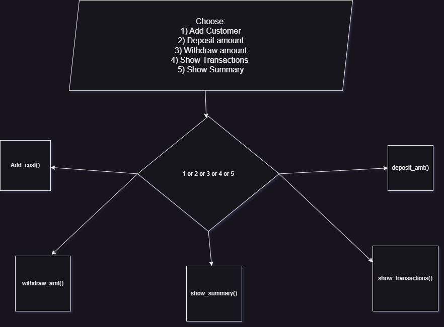

# Logic of the program
* creating a class within a main class which will take care of remebering all the details about the customer.
* creating simple function like add_cust(), withdraw(), transactions(), etc for specific task.
* we have takeen array objects for prev_amt, new_amt, with_amt, etc to remember the previous and new balance before and after withdrawing or depositing the money by the user. This helps us to show transaction in transation() function, where we are printing this arrays resulting detail report of every deposit, withdraw done by the user and its effect on the current and total balance.
* very simple flow chart of the program is given below.

