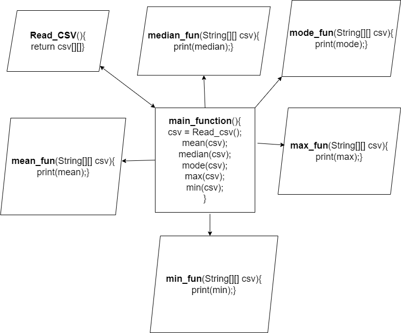

# In this java program we are finding the 5-point summary [Mean, Median, Mode, Min, Max] where we are fetching the data points from the famous Iris dataset csv file.

### we will calulate the 5-point summary [Mean, Median, Mode, Min, Max] for the attributes SepalLengthCm, SepalWidthCm, PetalLengthCm, PetalWidthCm and the categories like Iris-setosa, Iris-versicolor, Iris-virginica.

### Below given is the flow chart for the about for the programe.

## Follwing are the step-wise flow of the programe:
1. Getting the values from the Iris csv file
2. segregatting the values as per categories(i.e Iris_setosa, Iris_versicoloe, etc) and columns like sepal_length,Petal_length, etc.
3. Passing the segregated data to the respective functions (mean, median, mode, max and min) and printing the respective results.
